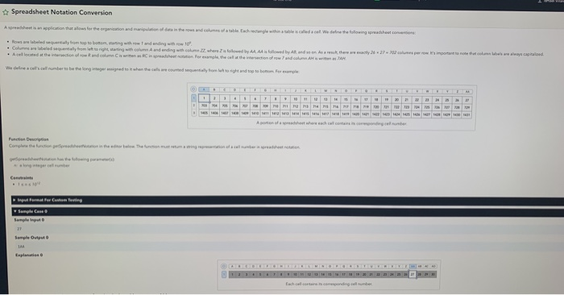

# 5 min Intro
# 2 coding questions
# 5 min question to ask 
# Platform:- hackerrank codepair

Q1. A Company parses logs of online store user transactions/activity to flag fraudulent activity.
The log file is represented as an Array of arrays. The arrays consist of the following data:
[ <# of transactions>]
For example:

[345366 89921 45]

Note: the data is space delimited

So, the log data would look like:

[
[345366 89921 45],
[029323 38239 23]
...
]
Write a function to parse the log data to find distinct users that meet or cross a certain threshold.

The function will take in 2 inputs:
logData: Log data in form an array of arrays

threshold: threshold as an integer

Output:
It should be an array of userids that are sorted.

If same userid appears in the transaction as userid1 and userid2, it should count as one occurrence, not two.

Example:
Input:
logData:

[
[345366 89921 45],
[029323 38239 23],
[38239 345366 15],
[029323 38239 77],
[345366 38239 23],
[029323 345366 13],
[38239 38239 23]
...
]
threshold: 3

Output: [345366 , 38239, 029323]

# Used Hashmap and after one mistake that i overlooked and she corrected I passed all test cases - Presense of mind

Q2.SpreadSheet notation conversion

Couldnt convert 1 number to A character - (char) number + 'A' - 1
